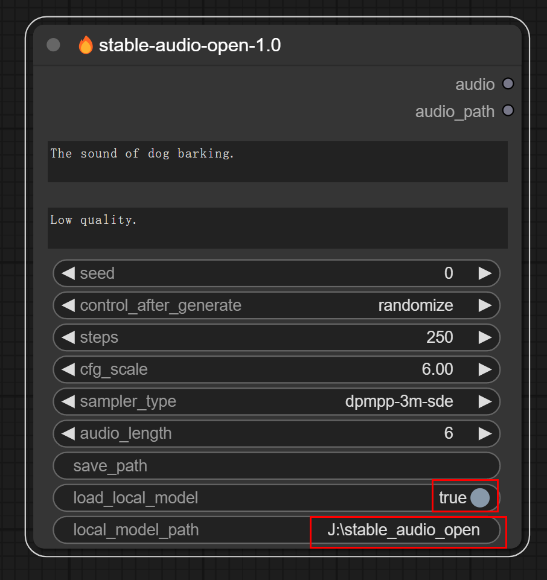

<h1 align="center">ComfyUI-StableAudioOpen</h1>

      中文 | <a href="README_EN.md">English</a>

## 介绍

音频生成模型 **stable-audio-open** 在ComfyUI中的实现，让ComfyUI也可以实现文生音频功能。 

## 安装 

#### 方法1:

1. 进入节点目录, `ComfyUI/custom_nodes/`
2. `git clone https://github.com/MoonHugo/ComfyUI-StableAudioOpen.git`
3. `cd ComfyUI-StableAudioOpen`
4. `pip install -r requirements.txt`
5. 重启ComfyUI

#### 方法2:
直接下载节点源码包，然后解压到custom_nodes目录下，最后重启ComfyUI

#### 方法3：
通过ComfyUI-Manager安装，搜索“ComfyUI-StableAudioOpen”进行安装

## 使用说明

###### 参数说明
**prompt**: 正向提示词，比如：`The sound of dog barking.` 
**negative_prompt**: 反向提示词，比如：`Low quality.` 
**seed**: 整数类型，设置种子值来确保结果的可重复性，取值范围在0到0xffffffffffffffff之间。 
**control_after_generate**: 种子变化方式，有固定、增加、减少、随机四种方式。 
**steps**: 生成音频步数，比如：`250` 
**cfg_scale**: 取值范围是0到10，默认值为6，值越高，生成的内容通常更紧密地符合给定的描述，但可能牺牲一些创造性。 
**sampler_type**: 采样类型，有dpmpp-3m-sde、dpmpp-2m-sde、k-heun、k-dpmpp-2s-ancestral、k-dpm-2、k-dpm-fast六种采样类型。 
**audio_length**: 设置生成的音频长度，单位是秒，最高可以生成47秒的音频。 
**save_path**: 设置保存音频路径，比如：`C:\Users\Desktop\`，如果为空，则默认保存在`ComfyUI\output\stable-audio-open-1.0`里面。 
**load_local_model**: 加载本地模型，默认值是False。 
**local_model_path**: 加载本地模型的时候需要把load_local_model设置为True，并把local_model_path设置为本地模型所在路径，例如：J:\stable_audio_open，如下所示：

**模型下载地址：**[https://huggingface.co/stabilityai/stable-audio-open-1.0](https://huggingface.co/stabilityai/stable-audio-open-1.0)

## 社交账号
- Bilibili：[我的B站主页](https://space.bilibili.com/1303099255)

## 感谢

感谢stabilityai/stable-audio-open-1.0仓库的所有作者 [stabilityai/stable-audio-open-1.0](https://huggingface.co/stabilityai/stable-audio-open-1.0)

## 关注历史

